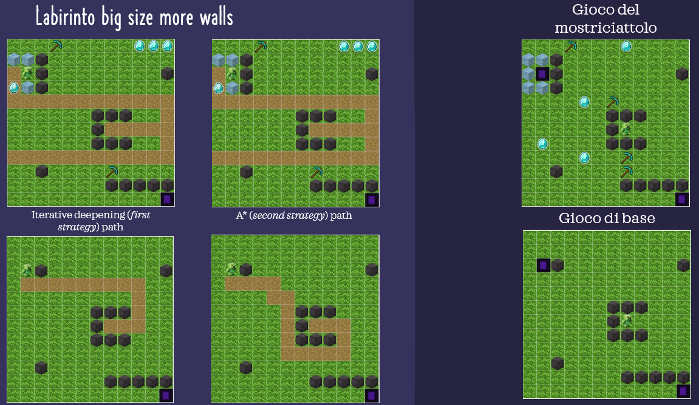

# Artificial Intelligence Project Suite

This project provides a exploration of classical Artificial Intelligence methodologies, focusing on search algorithms, logic programming, and expert systems. The work is organized into three distinct modules:

* **State-Space Search:** A comparative implementation of various search strategies—including both informed and uninformed approaches—to identify optimal paths and solutions within defined state spaces.
* **Knowledge Representation and ASP:** Application of **Answer Set Programming (ASP)** for automated reasoning. This section demonstrates the power of declarative logic in modeling and solving complex constraint satisfaction tasks.
* **Rule-Based Adversarial Agents:** Design and implementation of an intelligent opponent for the board game **Othello**. The agent utilizes a rule-based architecture via the **CLIPS** (C Language Integrated Production System) environment, interfaced with Python through the `pyclips` library to bridge symbolic reasoning with procedural control.

## State-Space Search (Progetto - prima parte)

This module focuses on the development of a symbolic AI agent designed to navigate grid-based environments and solve reachability problems using **Prolog**. The project is structured into two levels of increasing complexity:

* **Baseline Environment:** A standard pathfinding task where the agent must compute a valid trajectory toward a target portal while successfully navigating around static obstacles.
* **Dynamic Resource Management (Advanced Level):** An extended environment requiring complex decision-making. In this scenario, the agent’s action space is expanded to include environmental interactions, such as:
    * **Resource Acquisition:** Collecting tools (hammers) to modify the environment by destroying specific barriers.
    * **Objective Optimization:** Gathering collectibles (gems) while maintaining path efficiency.

### System Integration
The logic engine is seamlessly integrated with a **Python** front-end via the `pyswip` library, bridging the gap between symbolic reasoning and procedural interface management.

## Automated League Scheduling via Answer Set Programming (ASP)

This module addresses the complex combinatorial problem of generating an optimized professional sports calendar. By leveraging **Answer Set Programming (ASP)**, the system formalizes the scheduling requirements as a set of logical constraints, ensuring a valid and fair distribution of matches.

### Logical Framework & Constraints
The scheduling engine is implemented in **Clingo** and enforces several high-level integrity constraints to model a realistic tournament (e.g., a 16-team league over 30 matchdays):

* **Round-Robin Structure:** Ensures every team plays against all others exactly twice—once at home and once away.
* **Temporal Partitioning:** Strict separation between the "First Leg" (*Andata*) and the "Second Leg" (*Ritorno*), preventing reciprocal matches from occurring within the same half of the season.
* **Logistical Optimization (Shared Stadiums):** A specific constraint manages teams sharing the same venue (e.g., Inter and Milan, Juventus and Torino). The solver ensures that two teams with the same stadium never play at home during the same matchday.
* **Competitive Fairness:** Prevents "streak" imbalances by restricting teams from playing more than two consecutive matches either at home or away.

### System Architecture
The solution employs a hybrid architecture that combines declarative logic with procedural processing:

1.  **Logic Solver (Clingo):** Processes the `.cl` encoded rules to find a stable model (a valid calendar) that satisfies all constraints.
2.  **Python Integration:** A wrapper script manages the execution of the solver, capturing the output in JSON format via the `--outf=2` flag.
3.  **Data Parsing & Formatting:** Using `regex` and `json` libraries, the Python component parses the raw symbolic output into a human-readable, chronologically ordered sports calendar.

## Intelligent Adversarial Agent (Othello)

This module features a hybrid AI system designed to play **Othello**. The project combines a procedural Python-based game engine with a declarative **Expert System** implemented in **CLIPS** to handle complex decision-making and strategic reasoning.

### Hybrid System Architecture
The agent’s architecture bridges two distinct programming paradigms:
* **Procedural Layer (Python):** Manages the game state, board logic, legal move validation, and the graphical user interface (GUI) developed using `customtkinter` and `turtle`.
* **Inference Layer (CLIPS):** Acts as the "brain" of the agent. It utilizes a production rule system to evaluate the board state and select the optimal move based on the active heuristic.
* **Integration:** Communication between these layers is handled via the `clips` (PyCLIPS) library, which allows the Python environment to assert facts into the CLIPS knowledge base and trigger the inference engine.

### Multi-Level Strategic Heuristics
The AI provides three levels of difficulty, each utilizing progressively more sophisticated reasoning:

1. **Baseline (Easy):** A stochastic approach where the agent identifies all legal moves and selects one based on a simple priority list without deep strategic analysis[cite: 115, 127].
2. **Positional Strategy (Hard):** This level focuses on **Positional Advantage**. It categorizes board cells into specific types (e.g., COR for corners, X and C for squares adjacent to corners) and assigns them dynamic costs[cite: 122, 123, 148]. The agent prioritizes corner acquisition as a dominant strategy for victory.
3. **Frontier-Based Strategy (Very Hard):** The most advanced heuristic, which incorporates **Frontier Minimization**. In addition to positional costs, the agent calculates the number of "frontiers" (occupied cells adjacent to empty ones) created by a move[cite: 155, 156]. By minimizing its own frontiers, the AI restricts the opponent's mobility and future strategic options.

### Knowledge Representation
The CLIPS engine utilizes a structured set of templates and rules to model the game environment:
* **Cell Templates:** Define the properties of each board square, including its coordinates, content (black, white, or empty), and strategic type (COR, X, C, A, B, or F)[cite: 69, 73].
* **Cost Evaluation Rules:** Rules like `update-cost-of-cell` and `update-cost-of-certain-cell-X` dynamically adjust move priorities based on the current game step and difficulty level.
* **Frontier Management:** Advanced rules monitor the density of the board to prevent the user from gaining a positional foothold on the edges or corners.

### Performance Insights
Experimental results indicate that the **Very Hard** strategy is significantly more effective against experienced players because it forces the opponent into sub-optimal moves by limiting their available search space. Conversely, the **Hard** strategy remains highly competitive for standard play due to its rapid pursuit of corner dominance.